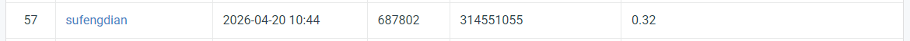

## HW2 - Digit Detection with DETR

### Introduction
This project implements a digit detection system using DETR (Detection Transformer) with a ResNet-50 backbone. Given an RGB image, the model detects and localizes each individual digit (0–9) with a bounding box. The model achieves a mAP of **0.32** on the competition public leaderboard.

### Environment Setup
```bash
pip install torch torchvision transformers pycocotools albumentations matplotlib tqdm
```

### Usage

#### Project Structure
```
cv_hw2/
├── code/
│   ├── train.py        # Training script
│   └── inference.py    # Inference & visualization script
├── data/
│   ├── train/          # Training images
│   ├── valid/          # Validation images
│   ├── test/           # Test images
│   ├── train.json      # Training annotations (COCO format)
│   └── valid.json      # Validation annotations (COCO format)
├── model/              # Saved checkpoints & training log
└── visualizations/     # Output visualizations
```

#### Training
```bash
CUDA_VISIBLE_DEVICES=1 python code/train.py
```
Checkpoints are saved under `model/`. Training log is recorded in `model/train_log.csv`.

#### Inference
```bash
# Evaluate on validation set + generate visualizations
CUDA_VISIBLE_DEVICES=1 python code/inference.py --mode val --threshold 0.05

# Generate pred.json for test set submission
CUDA_VISIBLE_DEVICES=1 python code/inference.py --mode test --threshold 0.05

# Both
CUDA_VISIBLE_DEVICES=1 python code/inference.py --mode both --threshold 0.05
```

### Performance Snapshot
| Split | mAP@0.50:0.95 | mAP@0.50 |
|-------|--------------|----------|
| Validation | 0.401 | 0.793 |
| Public Leaderboard | 0.32 | - |



### References
- Carion et al., "End-to-End Object Detection with Transformers", ECCV 2020
- HuggingFace Transformers: https://huggingface.co/facebook/detr-resnet-50
